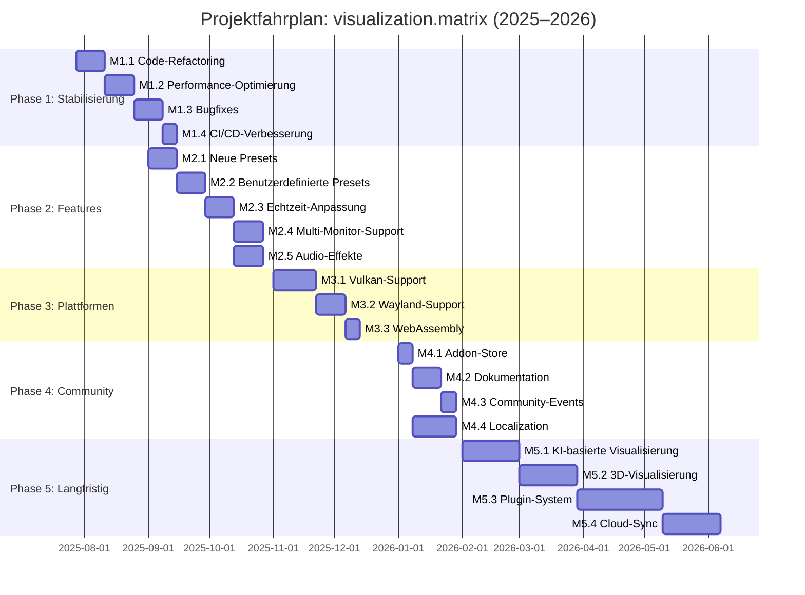

# 🗺️ Projektfahrplan: visualization.matrix

> **Status:** Aktive Entwicklung | **Letzte Aktualisierung:** 2025-08-31
> **Version:** 1.0.0

Dieser Fahrplan beschreibt die strategischen Ziele, Meilensteine und Zeitpläne für die Weiterentwicklung des **visualization.matrix** Kodi-Addons. Das Projekt ist ein OpenGL/GLSL-basiertes Visualisierungs-Addon für Kodi mit Fokus auf Matrix-inspirierte Effekte und Echtzeit-Audioanalyse.

---

## 📌 Projektübersicht

- **Repository:** [MarcelRaschke/visualization.matrix](https://github.com/MarcelRaschke/visualization.matrix)
- **Sprache:** C++17
- **Technologien:** OpenGL, GLSL, kissfft, CMake
- **Aktuelle Features:** 8 Presets, FFT-basierte Audioanalyse, Multiplattform-Support
- **Aktuelle Version:** Siehe [CHANGELOG.md](CHANGELOG.md)

---

## 🎯 Projektvision

**Ziel:** Das beste Visualisierungs-Addon für Kodi werden – mit Fokus auf:
- ✅ **Performance:** Flüssige 60+ FPS auf Referenzhardware (RPi 4, Android TV)
- ✅ **Flexibilität:** Benutzerdefinierte Presets und Echtzeit-Anpassung
- ✅ **Plattformunterstützung:** OpenGL, Vulkan, Wayland, WebAssembly
- ✅ **Community:** Aktive Mitwirkung und einfache Erweiterbarkeit
- ✅ **Innovation:** KI-basierte Effekte und 3D-Visualisierung

---

---

# 📅 Meilenstein-Plan (2025–2026)

---

## 🟢 Phase 1: Stabilisierung & Optimierung (Q3 2025 – 4 Wochen)

**Ziel:** Behebung von Bugs, Performance-Optimierung und Verbesserung der Codequalität.

| Meilenstein | Beschreibung | Priorität | Zeitrahmen | Verantwortlich | Erfolgsmetrik |
|-------------|--------------|-----------|------------|----------------|---------------|
| **M1.1: Code-Refactoring** | Bereinigung von technischer Schuld (z. B. `main.cpp` ist 600+ Zeilen, unübersichtlich). | Hoch | Woche 1–2 | Core-Team | Code-Coverage ≥ 80%, SonarQube A-Rating |
| **M1.2: Performance-Optimierung** | Optimierung der FFT-Berechnung (kissfft) und OpenGL-Rendering-Pipeline. | Hoch | Woche 2–3 | Core-Team | FPS ≥ 60 auf Referenzhardware (RPi 4) |
| **M1.3: Bugfixes** | Behebung bekannter Issues (z. B. Memory Leaks, Crashs bei Preset-Wechsel). | Hoch | Woche 3–4 | Core-Team | 0 kritische Bugs in `master` |
| **M1.4: CI/CD-Verbesserung** | Reduzierung der Workflow-Laufzeit (aktuell ~15 Min. pro PR). | Mittel | Woche 4 | DevOps | CI-Laufzeit < 10 Min. |

**Abhängigkeiten:**
- M1.1 → M1.2 (Refactoring vor Performance-Optimierung)
- M1.2 → M1.3 (Performance-Tests als Teil der Bugfixes)

---

## 🟡 Phase 2: Feature-Erweiterungen (Q4 2025 – 8 Wochen)

**Ziel:** Neue Visualisierungsoptionen und Benutzerfreundlichkeit.

| Meilenstein | Beschreibung | Priorität | Zeitrahmen | Verantwortlich | Erfolgsmetrik |
|-------------|--------------|-----------|------------|----------------|---------------|
| **M2.1: Neue Presets** | Hinzufügen von 4 neuen Presets (z. B. "Cyberpunk", "Neon", "Retro", "Minimalist"). | Hoch | Woche 1–2 | Designer/Entwickler | 12 Presets insgesamt |
| **M2.2: Benutzerdefinierte Presets** | Ermöglichen von benutzerdefinierten GLSL-Shadern (Upload über UI). | Hoch | Woche 3–4 | Core-Team | Feature in `v2.0.0` |
| **M2.3: Echtzeit-Anpassung** | UI für Echtzeit-Anpassung von Parametern (z. B. Farbpalette, Geschwindigkeit, Dichte). | Mittel | Woche 5–6 | UX-Team | Nutzerumfrage: ≥ 80% Zufriedenheit |
| **M2.4: Multi-Monitor-Support** | Unterstützung für mehrere Bildschirme (z. B. für Digital Signage). | Niedrig | Woche 7–8 | Core-Team | Test auf 2+ Monitoren |
| **M2.5: Audio-Effekte** | Integration von Audio-Effekten (z. B. Bass-Boost-Visualisierung). | Mittel | Woche 6–7 | Audio-Experte | 3 neue Audio-Effekte |

**Abhängigkeiten:**
- M2.1 → M2.2 (Preset-System muss stabil sein)
- M2.2 → M2.3 (Benutzerdefinierte Presets benötigen UI-Anpassungen)

---

## 🔵 Phase 3: Plattform-Erweiterung (Q1 2026 – 6 Wochen)

**Ziel:** Unterstützung für weitere Plattformen und Backends.

| Meilenstein | Beschreibung | Priorität | Zeitrahmen | Verantwortlich | Erfolgsmetrik |
|-------------|--------------|-----------|------------|----------------|---------------|
| **M3.1: Vulkan-Support** | Portierung der Rendering-Engine von OpenGL zu Vulkan (für bessere Performance auf Android). | Hoch | Woche 1–3 | Grafik-Experte | Vulkan-Rendering funktioniert auf Android |
| **M3.2: Wayland-Support** | Kompatibilität mit Wayland (für Linux-Distributionen wie Ubuntu 24.04+). | Mittel | Woche 4–5 | Linux-Experte | Test auf Ubuntu 24.04 |
| **M3.3: WebAssembly (WASM)** | Experimentelle Portierung für Browser (z. B. für Kodi Web-Player). | Niedrig | Woche 6 | Forschungs-Team | Proof-of-Concept |

**Abhängigkeiten:**
- M3.1 → M3.2 (Vulkan als Basis für Wayland)

---

## 🟣 Phase 4: Community & Ökosystem (Q2 2026 – 4 Wochen)

**Ziel:** Stärkung der Community und Integration in das Kodi-Ökosystem.

| Meilenstein | Beschreibung | Priorität | Zeitrahmen | Verantwortlich | Erfolgsmetrik |
|-------------|--------------|-----------|------------|----------------|---------------|
| **M4.1: Addon-Store-Integration** | Offizielle Veröffentlichung im Kodi Addon-Store. | Hoch | Woche 1 | Maintainer | Addon im Store verfügbar |
| **M4.2: Dokumentation** | Vollständige API-Dokumentation (Doxygen) und Tutorials für Entwickler. | Mittel | Woche 2–3 | Tech-Writer | Dokumentation ≥ 90% abgedeckt |
| **M4.3: Community-Events** | Organisation von Hackathons oder Contribution-Days (z. B. auf Kodi-Forum/Discord). | Niedrig | Woche 4 | Community-Manager | ≥ 5 neue Contributors |
| **M4.4: Localization** | Übersetzungen für 10 weitere Sprachen (aktuell: 8 Sprachen). | Mittel | Woche 2–4 | Übersetzungs-Team | 18 Sprachen unterstützt |

**Abhängigkeiten:**
- M4.1 → M4.2 (Dokumentation für Store-Nutzer)

---

## 🣠 Phase 5: Langfristige Ziele (Q3 2026 – 12 Wochen)

**Ziel:** Innovative Features und Skalierung.

| Meilenstein | Beschreibung | Priorität | Zeitrahmen | Verantwortlich | Erfolgsmetrik |
|-------------|--------------|-----------|------------|----------------|---------------|
| **M5.1: KI-basierte Visualisierung** | Integration von KI-Modellen (z. B. TensorFlow Lite) für dynamische Effekte. | Hoch | Woche 1–4 | KI-Experte | Proof-of-Concept |
| **M5.2: 3D-Visualisierung** | Unterstützung für 3D-Effekte (z. B. VR/AR). | Niedrig | Woche 5–8 | 3D-Experte | 2 neue 3D-Presets |
| **M5.3: Plugin-System** | Modulares Plugin-System für benutzerdefinierte Effekte. | Hoch | Woche 9–12 | Core-Team | Plugin-API stabil |
| **M5.4: Cloud-Sync** | Synchronisation von Presets und Einstellungen über Kodi-Konto. | Mittel | Woche 10–12 | Backend-Team | Feature in `v3.0.0` |

**Abhängigkeiten:**
- M5.1 → M5.3 (KI-Integration als Plugin)
- M5.3 → M5.4 (Plugin-System als Basis für Cloud-Sync)

---

---

# 📊 Zusammenfassung nach Prioritäten

| Priorität | Meilensteine | Gesamtaufwand | Zeitrahmen |
|-----------|--------------|----------------|------------|
| **Hoch** | M1.1, M1.2, M1.3, M2.1, M2.2, M3.1, M4.1, M5.1, M5.3 | ~24 Wochen | Q3 2025 – Q3 2026 |
| **Mittel** | M1.4, M2.3, M2.5, M3.2, M4.2, M4.4, M5.4 | ~16 Wochen | Q3 2025 – Q3 2026 |
| **Niedrig** | M2.4, M3.3, M4.3, M5.2 | ~8 Wochen | Q4 2025 – Q3 2026 |

---

# 📈 Erfolgsmetriken (KPIs)

| Metrik | Zielwert (2025) | Zielwert (2026) | Messmethode |
|--------|-----------------|-----------------|-------------|
| **Nutzerzufriedenheit** | ≥ 4.5/5 (Store) | ≥ 4.7/5 (Store) | Kodi Addon-Store Bewertungen |
| **Download-Zahlen** | 50.000/Monat | 100.000/Monat | GitHub Releases / Kodi Stats |
| **Code-Coverage** | ≥ 70% | ≥ 85% | SonarQube / Codecov |
| **CI-Laufzeit** | < 15 Min. | < 10 Min. | GitHub Actions Metrics |
| **Anzahl Contributors** | 5 | 15 | GitHub Insights |
| **Anzahl unterstützte Sprachen** | 8 | 18 | Weblate |
| **Anzahl Presets** | 8 | 20 | Codebase |
| **Performance (FPS)** | ≥ 50 (RPi 4) | ≥ 60 (RPi 4) | Benchmark-Tests |

---

# 🗓 Zeitplan (Gantt-Chart)

---

# ⚠️ Risiken & Mitigationsstrategien

| Risiko | Auswirkung | Mitigationsstrategie |
|--------|------------|----------------------|
| **Performance-Probleme** | Vulkan-Portierung könnte auf älteren Geräten langsamer sein. | Benchmarking auf Referenzhardware (RPi 3/4, Android TV). |
| **Plattform-Kompatibilität** | Wayland-Support könnte mit einigen Linux-Distributionen inkompatibel sein. | Frühzeitiges Testen mit Community (Beta-Tests). |
| **Community-Beteiligung** | Geringe Beteiligung an Hackathons. | Aktive Bewerbung auf Kodi-Forum, Discord und Social Media. |
| **KI-Integration** | Hoher Rechenaufwand für KI-Modelle auf schwacher Hardware. | Nutzung von TensorFlow Lite für Mobile/Embedded. |
| **Wartungskosten** | Zu viele neue Features könnten die Wartung erschweren. | Fokus auf Modularität (Plugin-System) und automatisierte Tests. |
| **Ressourcenmangel** | Fehlende Experten für Vulkan/KI. | Externe Contributors gewinnen, Dokumentation verbessern. |

---

# 🛠 Ressourcen & Tools

| Kategorie | Tools/Technologien |
|-----------|---------------------|
| **Entwicklung** | C++17, OpenGL, Vulkan, GLSL, CMake, Git |
| **CI/CD** | GitHub Actions, Azure Pipelines, Jenkins, Docker |
| **Sicherheit** | CodeQL, clang-tidy, cppcheck, Trivy, Snyk, OWASP ZAP, SonarQube, Semgrep |
| **Dokumentation** | Doxygen, Markdown, GitHub Wiki |
| **Community** | Kodi-Forum, Discord, GitHub Issues, Weblate (Übersetzungen) |
| **Testing** | Google Test, Catch2, AFL++ (Fuzzing), Valgrind (Memory Leaks) |
| **Monitoring** | SonarQube, Codecov, GitHub Insights |

---

# 📝 Nächste Schritte

## 🔹 Kurzfristig (Q3 2025)
- [ ] **Priorisierung klären:** Soll der Fokus auf **Stabilisierung (Phase 1)** oder **neuen Features (Phase 2)** liegen?
- [ ] **Ressourcen planen:** Wer übernimmt die **Vulkan-Portierung (M3.1)**? (Benötigt Grafik-Experten)
- [ ] **Community einbinden:** Umfrage auf Kodi-Forum/Discord: Welche Features sind am wichtigsten?
- [ ] **Technische Vorbereitung:** Benchmarking-Tools für Performance-Messungen (M1.2, M3.1) einrichten.

## 🔹 Mittelfristig (Q4 2025)
- [ ] **Doxygen** für API-Dokumentation (M4.2) einrichten
- [ ] **Beta-Tests** für neue Presets (M2.1) und Vulkan-Support (M3.1) starten
- [ ] **Contributor-Guides** aktualisieren (für M2.2, M5.3)

## 🔹 Langfristig (2026)
- [ ] **KI-Experten** für M5.1 gewinnen
- [ ] **Plugin-Architektur** entwerfen (M5.3)
- [ ] **Cloud-Infrastruktur** für M5.4 planen

---

# 🔗 Verwandte Dokumente

- [README.md](README.md) – Projektübersicht
- [CONTRIBUTING.md](CONTRIBUTING.md) – Beitragsrichtlinien
- [CHANGELOG.md](CHANGELOG.md) – Versionshistorie
- [SECURITY.md](SECURITY.md) – Sicherheitsrichtlinien
- [SHADERS.md](SHADERS.md) – Shader-Dokumentation
- [.github/workflows/](.github/workflows/) – CI/CD-Pipelines

---

# 💬 Feedback & Mitwirkung

Hast du Fragen, Ideen oder möchtest du zu einem Meilenstein beitragen?

- **Issues & Diskussionen:** [GitHub Issues](https://github.com/MarcelRaschke/visualization.matrix/issues)
- **Kodi-Forum:** [Forum Thread](https://forum.kodi.tv)
- **Discord:** [Kodi Community Discord](https://discord.gg/kodi)
- **Contributing:** Siehe [CONTRIBUTING.md](CONTRIBUTING.md)

---

> **Hinweis:** Dieser Fahrplan ist ein lebendiges Dokument und wird regelmäßig aktualisiert. Letzte Änderungen: 2025-08-31.
